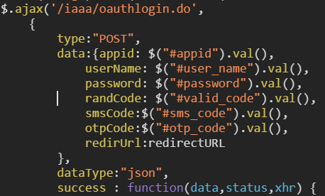

# PKUCard
简单的抓取校园卡消费记录的习作


一开始我是想抓取自己的消费记录，并做一个分析，所以有生成csv的环节。当我按照正常的顺序做完之后，看到中转那么多网页，然后就产生了优化一下的想法，看看哪些网页可以去掉。

然后当我注释掉用token GET的网页后仍然得到了数据 :thinking: 然后就发现了。。。


## 惊天大秘密！

不用知道密码就可查询任何学号的消费信息！

<https://bbs.pku.edu.cn/v2/post-read.php?bid=668&threadid=17344380>

（难以遏制心中的激动情绪。。）

贴上官方回复：

> 同学你好，
>
> 感谢你对学校网络信息安全的关注与支持，我们已核实确认了你发现的漏洞，并转给了校园卡中心。校园卡中心已暂停相关网站，并抓紧进行整改修复。
>
> 
>
> 建议等问题修复后再公开，谢谢！
>
> 
>
> 计算中心
>
> 2019.10.6

---

记得修改`config.py`啊！懒得写命令行了！

---

啊！bug修好了！`origin.py`还能用！已经把`config.py`改成运行时关闭回显（不显示字符）提示输入密码的形式。

大家可以用来查自己的记录了！

## 分解动作
```python
from requests import Session

with Session() as s:
    do_sth()
```

因为这里需要一系列连贯的操作以保持登录状态，故`Session`是个好东西

#### 校园卡网站开始

一开始我打算从校园卡网站开始这波操作。于是Chrome，右键，检查，得到


真是个可读性极佳的代码！接下来搜索`goPage`是很自然的：


这里只截取了相关的内容，后边还有一大堆这里没有传进来的参数。接着看它干了什么：


搜索`form`


哇，js手动填一个隐形表单，这么感人！

然后我就——手动把表单打进了Python文件！

```python
r = s.post('https://card.pku.edu.cn/Page/Page', data={
        'flowID': 15,
        'type': 1,
        'apptype':  2,
        'Url': '%23',
        'MenuName': '流水查询',
        'EMenuName': '流水查询',
    })
```

#### 来到iaaa

发现不妙。我是蠢了，为什么要从校园卡网站开始？从登录页面开始不挺好的吗？:joy:

继续右键检查登录按钮：


嗯？怎么又是`submit`又是`onclick`？What? 这里就不卖关子了：


通过`return false`的“土办法”阻止表单提交。（那你:footprints::horse:为什么要做一个`form`？）

好，继续看`oauthLogon`:



又是填表单！还好这次是`json`。可以把`data`这段代码复制到`Chrome Console`里面运行（也不见得快多少）。但是，无论我怎样反复核查无误，总是返回错误。。终于在我历经千难万险之后，发现我被`dataType:"json"`成功误导，写成了`s.post('...', json={...})`。改成`data={...}`就没事啦：

```python
r = s.post('https://iaaa.pku.edu.cn/iaaa/oauthlogin.do', data={
    'appid': 'card_auth',
    'redirUrl': 'http://sfrzcard.pku.edu.cn/ias/prelogin?sysid=WXXY',
    'userName': config.user_name,
    'password': config.password,
})
```

返回：

```json
{success: true, token: "6f03f9.................ff4eec8d2"}
```

用`Response.json()`就可以转换成Python字典了。

继续看成功返回之后：


加随机数和`token`参数，用`GET`

```python
r = s.get(
    'http://sfrzcard.pku.edu.cn/ias/prelogin?sysid=WXXY',
    params={
        'rand': random(),
        'token': token,
    }
)
```

看返回：

```html
<!DOCTYPE HTML PUBLIC "-//W3C//DTD HTML 4.01 Transitional//EN">
<html>
<head>
<title>身份认证</title>
<meta http-equiv="pragma" content="no-cache">
<meta http-equiv="cache-control" content="no-cache">
<meta http-equiv="expires" content="0">
<script>
        function gid(id) {
                return document.getElementById(id);
        }
</script>
</head>
<body>
        <!-- isretnow,0复杂 -->
                <form id="loginForm" action="" method="post" style="display: hidden">
                        <input type="hidden" name="errorcode" id="errorcode"
                                value="1" /><input type="hidden" name="continueurl"
                                id="continueurl" value="" />
                                <input type="hidden" name="ssoticketid"
                                id="ssoticketid" value="你的学号（编者）" />
                </form>
                <script type="text/javascript">
                        document.getElementById('loginForm').action = 'https://card.pku.edu.cn/cassyno/index';
                        document.getElementById('loginForm').submit();
                </script>
</body>
</html>
```

我就不吐槽定义了`gid`而不用了。又是js填隐形表单。手动打进。

To be continued...