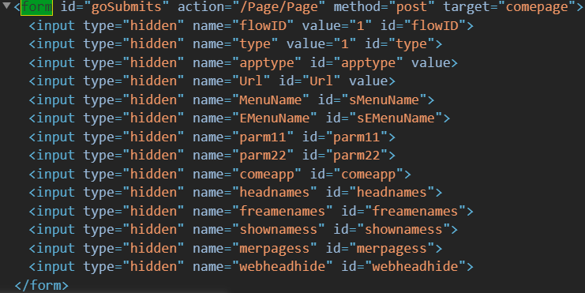

# PKUCard
简单的抓取校园卡消费记录的习作

- [惊天大秘密！](#惊天大秘密)
- [分解动作](#分解动作)
    - [校园卡网站开始](#校园卡网站开始)
    - [来到iaaa](#来到iaaa)
    - [回到校园卡大厅](#回到校园卡大厅)
    - [余额记录显示界面](#余额记录显示界面)
- [一波又起](#一波又起)


一开始我是想抓取自己的消费记录，并做一个分析，所以有生成csv的环节。当我按照正常的顺序做完之后，看到中转那么多网页，然后就产生了优化一下的想法，看看哪些网页可以去掉。

然后当我注释掉用token GET的网页后仍然得到了数据 :thinking: 然后就发现了。。。


## 惊天大秘密！

不用知道密码就可查询任何学号的消费信息！

<https://bbs.pku.edu.cn/v2/post-read.php?bid=668&threadid=17344380>

（难以遏制心中的激动情绪。。）

贴上官方回复：

> 同学你好，
>
> 感谢你对学校网络信息安全的关注与支持，我们已核实确认了你发现的漏洞，并转给了校园卡中心。校园卡中心已暂停相关网站，并抓紧进行整改修复。
>
> 
>
> 建议等问题修复后再公开，谢谢！
>
> 
>
> 计算中心
>
> 2019.10.6

---

记得修改`config.py`啊！懒得写命令行了！

---

啊！bug修好了！`origin.py`还能用！已经把`config.py`改成运行时关闭回显（不显示字符）提示输入密码的形式。

大家可以用来查自己的记录了！

## 分解动作
```python
from requests import Session

with Session() as s:
    do_sth()
```

因为这里需要一系列连贯的操作以保持登录状态，故`Session`是个好东西

#### 校园卡网站开始

一开始我打算从校园卡网站开始这波操作。于是Chrome，右键，检查，得到


真是个可读性极佳的代码！接下来搜索`goPage`是很自然的：


这里只截取了相关的内容，后边还有一大堆这里没有传进来的参数。接着看它干了什么：


搜索`form`



哇，js手动填一个隐形表单，这么感人！

然后我就——手动把表单打进了Python文件！

```python
r = s.post('https://card.pku.edu.cn/Page/Page', data={
        'flowID': 15,
        'type': 1,
        'apptype':  2,
        'Url': '%23',
        'MenuName': '流水查询',
        'EMenuName': '流水查询',
    })
```

#### 来到iaaa

发现不妙。我是蠢了，为什么要从校园卡网站开始？从登录页面开始不挺好的吗？:joy:

继续右键检查登录按钮：


嗯？怎么又是`submit`又是`onclick`？What? 这里就不卖关子了：


通过`return false`的“土办法”阻止表单提交。（那你:footprints::horse:为什么要做一个`form`？）

好，继续看`oauthLogon`:


又是填表单！还好这次是`json`。可以把`data`这段代码复制到`Chrome Console`里面运行（也不见得快多少）。但是，无论我怎样反复核查无误，总是返回错误。。终于在我历经千难万险之后，发现我被`dataType:"json"`成功误导，写成了`s.post('...', json={...})`。改成`data={...}`就没事啦：

```python
r = s.post('https://iaaa.pku.edu.cn/iaaa/oauthlogin.do', data={
    'appid': 'card_auth',
    'redirUrl': 'http://sfrzcard.pku.edu.cn/ias/prelogin?sysid=WXXY',
    'userName': config.user_name,
    'password': config.password,
})
```

返回：

```json
{success: true, token: "6f03f9.................ff4eec8d2"}
```

用`Response.json()`就可以转换成Python字典了。

继续看成功返回之后：


加随机数和`token`参数，用`GET`

```python
r = s.get(
    'http://sfrzcard.pku.edu.cn/ias/prelogin?sysid=WXXY',
    params={
        'rand': random(),
        'token': token,
    }
)
```

看返回：

```html
<!DOCTYPE HTML PUBLIC "-//W3C//DTD HTML 4.01 Transitional//EN">
<html>
<head>
<title>身份认证</title>
<meta http-equiv="pragma" content="no-cache">
<meta http-equiv="cache-control" content="no-cache">
<meta http-equiv="expires" content="0">
<script>
        function gid(id) {
                return document.getElementById(id);
        }
</script>
</head>
<body>
        <!-- isretnow,0复杂 -->
                <form id="loginForm" action="" method="post" style="display: hidden">
                        <input type="hidden" name="errorcode" id="errorcode"
                                value="1" /><input type="hidden" name="continueurl"
                                id="continueurl" value="" />
                                <input type="hidden" name="ssoticketid"
                                id="ssoticketid" value="你的学号（编者）" />
                </form>
                <script type="text/javascript">
                        document.getElementById('loginForm').action = 'https://card.pku.edu.cn/cassyno/index';
                        document.getElementById('loginForm').submit();
                </script>
</body>
</html>
```

**bug已经修好了，`ssoticketid`不再是学号，而是token，以下是之前的操作**

我就不吐槽定义了`gid`而不用了。又是js填隐形表单。手动打进。

```python
r = s.post('https://card.pku.edu.cn/cassyno/index', data={
    'errorcode': 1,
    'continueurl': '',
    'ssoticketid': config.user_name
})
```

#### 回到校园卡大厅

转了一圈又回来了。然后右键检查“流水信息”，唔，又是：


和一开始一模一样！差点以为第一步走了弯路！照搬！

#### 余额记录显示界面

这里就头大了，怎么那么多`Ajaxxxx`的东西啊！

这里有一个小技巧，把整个函数复制到`Console`里，把success的部分改成`console.log`，回车执行，就可以看到输出了！

然后可以右键检查“最近一个月”，但是没有`onclick`。没关系，点击`Event Listeners`选项卡，有`click`，就可以看到事件监听在哪里了：


Hard-coded dates... 我喜欢！

其他什么`datebox`不要管，自然转到`InitGrid`: 


哈！就在这里。这个`acc`应该就是转那么多圈要的用户ID了。

但是。。`datagrid`是什么？

感兴趣的同学可以查一下（也不用查，看看脚本列表就知道了），是`jquery-easyui`的表格函数。

一眼就知道是用POST，加上这三个参数。果然返回：

```json
{"issucceed":false,"name":null,"total":163,"tranamt":0,"tranamt1":0,"tranamt2":0,"parm1":null,"parm2":null,"trannum":0,"rows":[{"RO":1,"OCCTIME":"2019-10-05 17:37:07","EFFECTDATE":"2019-10-05 17:34:20","MERCNAME":"艺园食堂副食                            ","TRANAMT":-9.65,"TRANNAME":"持卡人消费                              ","TRANCODE":"15","CARDBAL":215.48,"JDESC":"","JNUM":16793305,"MACCOUNT":1000401,"F1":"1","F2":"11","F3":"2","SYSCODE":19,"POSCODE":12},{"RO":2,"OCCTIME":"2019-10-05 11:27:12",......
```

正当我满心欢喜要获取开学以来我的记录时，发现。。怎么就这么几条？怎么一直是15条？哦，原来一页15条！那怎么获取第二页？源码里没有写啊！难道要我去研究`jquery-easyui`吗？

施主莫慌，看我灵魂一笔：

```python
r = s.post('https://card.pku.edu.cn/Report/GetPersonTrjn', data={
    'sdate': config.start_date,
    'edate': config.end_date,
    'account': account,
    'page': i,  # bingo!
})
```

一猜就中！就是加一个`page`参数！

---

好啦，至此网页抓取内容就讲完了，数据处理部分感兴趣自己看源码吧！

## 一波又起

本来天真的我以为到此为止，画上一个圆满的句号:white_circle:

但是，漏洞谜之进化，惊现随机掉落的过程！且听我道来：


> 我发现我用我的账号用origin.py（原稿，把`ssoticketid`参数改成`token`）后，的确可以获得自己的数据。
> 
> 然后一段时间内，无论POST什么东西上去，都会返回自己的数据。估计是服务端实现了一个定时记录的机制。
> 
> 过了这段时间，就会随机掉落一位同学的记录（有时候是长时间等待或空值）！

然后我大胆假设，立下flag：这些同学恰巧这时登录系统，然后服务器记住了他们的登录状态（而不是像以前那样把一个key交给客户端）。这时我的程序进来了。服务器错将程序认为是之前操作的同学（也许是内网IP问题？），放心地把数据交给了我。

